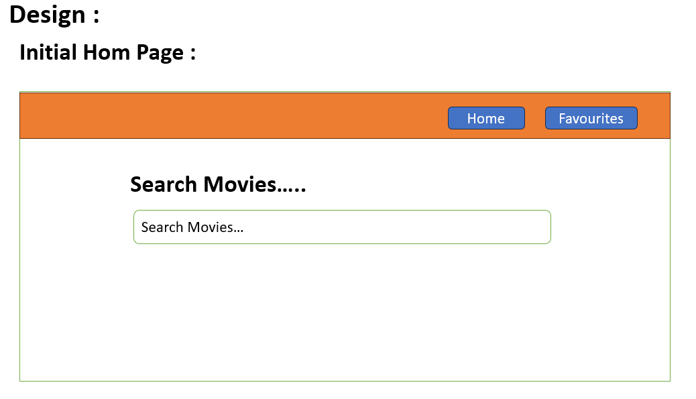
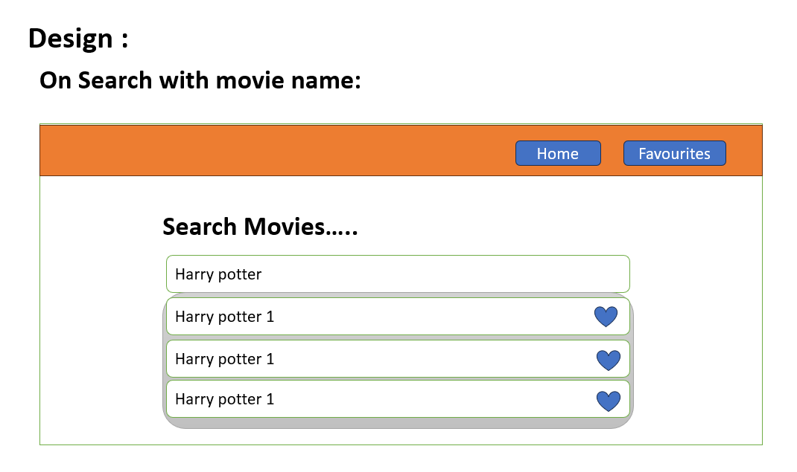
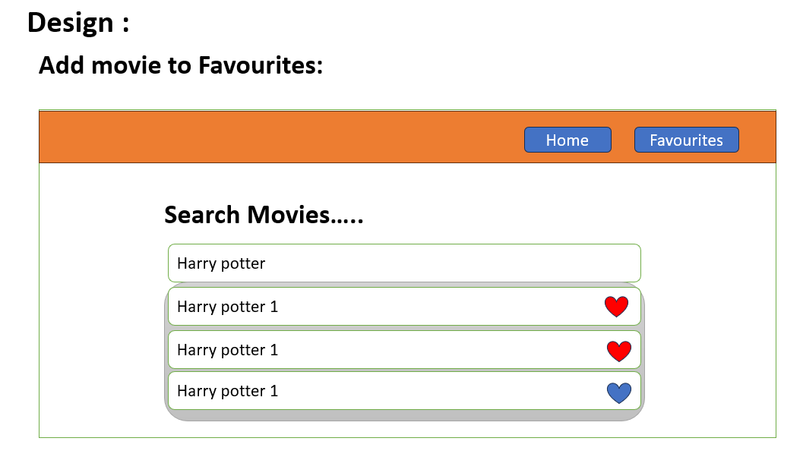
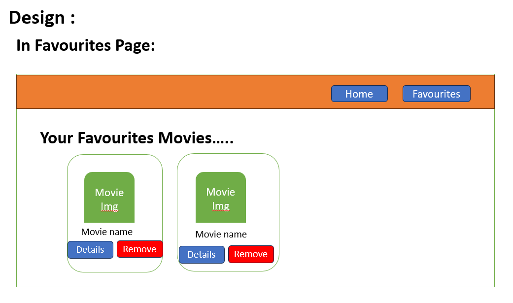
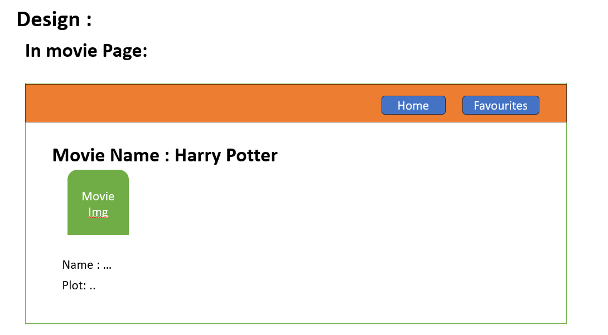

# IMDB Clone

# Live link - https://maheshh-busam.github.io/imdb-clone/

## Table of Contents

- [Introduction](#introduction)
- [Features](#features)
- [Design](#design)
- [Installation](#installation)
- [Usage](#usage)
- [Contact](#contact)

## Introduction

The IMDB clone is a web application, user can search movies and know the details of the movies and can add the mmovies to favorites.

## Features

- User can search the movies by using search bar.
- User can add the multiple movies to favorites.
- User-friendly interface.
- Can remove movies from favorites at any time.
- Get to know the details of the movie

## Design

## Initial page--



## On search of movies with name-- Display the list of moveis as searched--



## Add to favourites..



## Favourites Page..



## Get the details of movie..



## Installation

To run this project locally, follow these steps:

1. Clone the repository:
   ```sh
   git clone https://github.com/Maheshh-Busam/imdb-clone.git
   ```
2. Navigate to the project directory:
   ```sh
   cd imdb-clone
   ```

## Usage

To start the application, follow the below process..

```sh
    you can open with live server as per your code eiditor.
```

## Contact

Email Id - mahesh.busam2206@gmail.com
